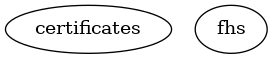

# Packages 👋



This repository produces a set of packages that can be used to build a rootfs suitable for creating custom Linux distributions.
The packages are published as a container image, and can be "installed" by simply copying the contents to your rootfs.
For example, using Containerfile, we can do the following:

```docker
FROM scratch
COPY --from=ghcr.io/sentinelos/<pkg>:<tag> / /
```


## License

This project is licensed under the Mozilla Public License Version 2.0 License - see the [LICENSE](LICENSE) file for details.

## Thank you

This project could not have been built without the following libraries or projects. They are either directly used in Sentinel OS or provided a lot of inspiration for the shape of the project:

- [The linux kernel](https://www.kernel.org/)
- [Git](https://git-scm.com/)
- [Alpine linux](https://www.alpinelinux.org/) and many others developers and companies.
